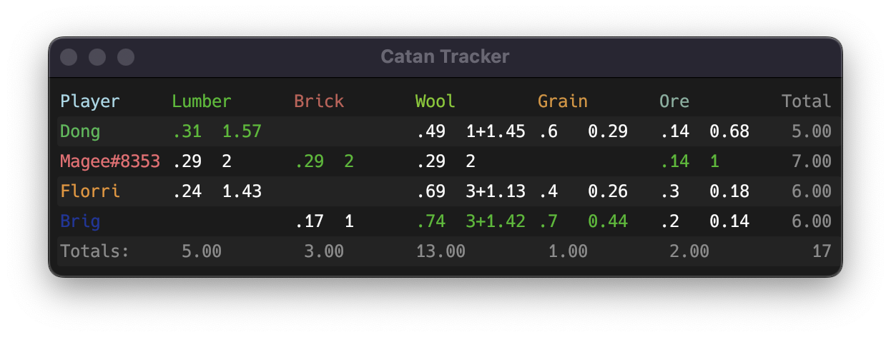

# Colonizer

A program that tracks your opponent's cards in Settlers of Catan on the site [colonist.io](https://colonist.io).



Taking the first player, Dong, as an example. For the lumber resource, the probability `.31` represents the odds of receiving that card if someone were to rob Dong. The field is green because you have the best odds of receiving lumber by robbing Dong. The `1.57` represents the expected value for the number of lumber that Dong has.

There are two ways the expected value is represented. The `1.57` for Dong indicates they have 1 lumber, and an expected extra amount of `0.57`. The `3+1.42` for Brig indicates they definitely hve 3 wool, and are expected to have `1.42` additional wool. 

The value 17 in the bottom-right is the number of possible states the game could be in. It can be thought of as the amount of uncertainty in the game, with a value of 1 being complete certainty.


## Instructions

1. Build the project
2. Run Chrome or Firefox in debug mode
3. Run the program

For example, on macOS with Google Chrome:
```shell
$ /Applications/Google\ Chrome.app/Contents/MacOS/Google\ Chrome --remote-debugging-port=9222 --user-data-dir=/tmp/data
$ cargo build --release
$ ./target/release/catan_tracker <username>
```

## How it works

Events are recorded to the in-game chat log. Colonizer communicates with the browser to acess the page's HTML using Chrome's [DevTools protocol](https://chromedevtools.github.io/devtools-protocol/). Colonizer parses the chat messages and updates the game state. The game events include receiving cards, discarding cards, monopoly, trading, and robbing. The only event that adds uncertainty to the game state is robbing.

The game state is represented using a 4x5 matrix (4 players, 5 resources each). Each cell represents the number of cards a player has for a given resource. When one player robs another, it creates new possible states for the game. The expected number of cards each player has can be calculated by taking the average of the possible states. Events such as trades or spending cards reduces the number of possible states.


## Future plans

- Refreshing the page clears the chat log and the program is unable to resume. The ability to start tracking a game in progress is being worked on.
- Track development cards
- Track dice rolls
